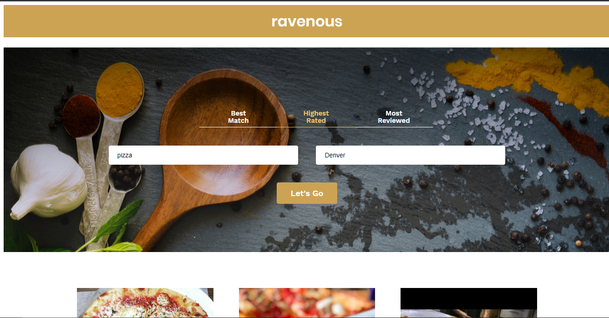

# Ravenous

A React app that utilizes the Yelp API to allow the user to search for restaurants by location.

## [Try it yourself](https://fathomless-river-62063.herokuapp.com/)



### Insallation

Git clone the repository to your local machine: 

HTTPS:
```
$ git clone https://github.com/SolomanGarcia/ravenous
```
SSH:
````
$ git clone git@github.com:SolomanGarcia/ravenous.git
````
Next, cd into the repository you cloned and install the necessary dependencies by running:
````
$ npm install
````

You will then be able to start the app locally by runnning:
````
$ npm start
````

## Built With
* [React.js](https://reactjs.org/) - MVC front-end framework
* [npm](https://www.npmjs.com/) - Dependency management

## Authors
See contribution history [here](https://github.com/SolomanGarcia/ravenous/graphs/contributors)

## Future Updates
At the moment, this app is a minimum viable product. In the future the UI/UX will be improved and the app will be converted to a full-stack app using MongoDB and Express.js.